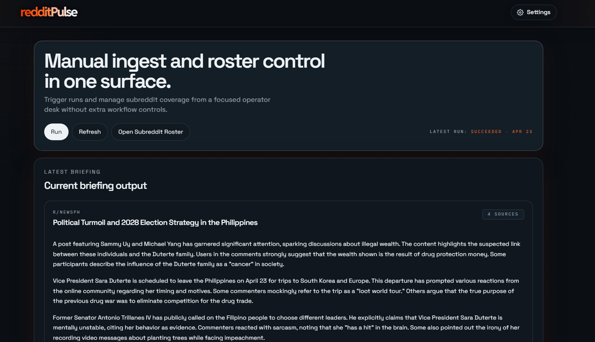
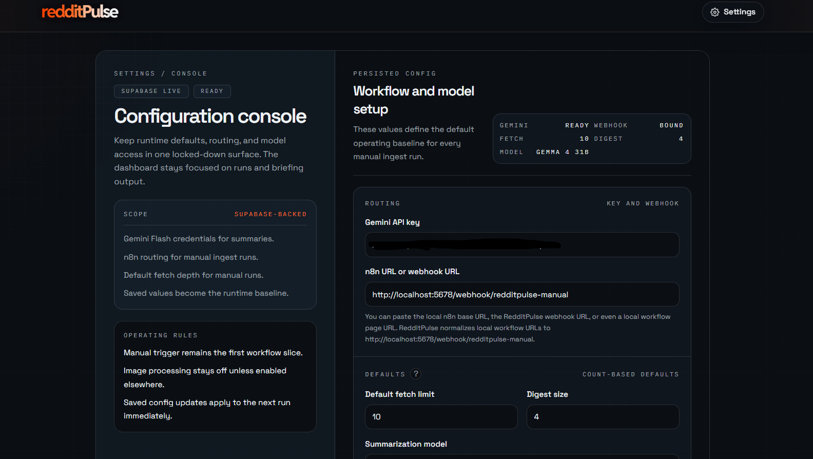
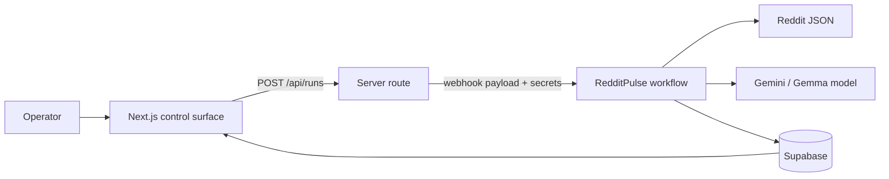
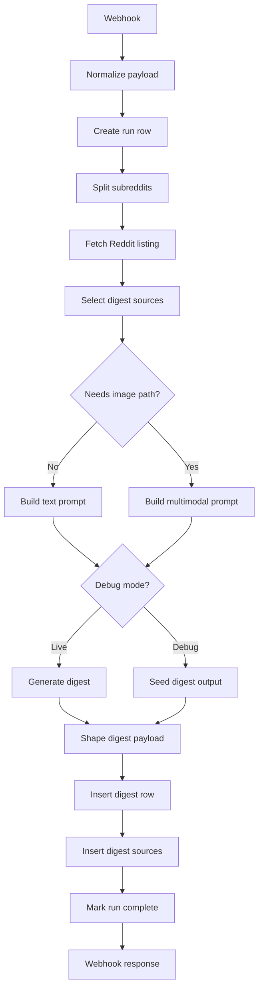

# RedditPulse

RedditPulse is a local-admin Reddit digest product built to show an end-to-end automation stack: a Next.js control surface, a visible node-driven n8n workflow, and Supabase-backed persistence for runs, digests, and source links.

The app is intentionally narrow. A user saves runtime settings, manages a subreddit roster, manually triggers a run, and lets n8n fetch Reddit posts, summarize the selected threads, and write the finished digest back to Supabase for display in the UI.

## Current UI

These screenshots reflect the current local build in this repository.

### Dashboard



### Settings



## What the project does

- Manual run trigger from a focused dashboard instead of a general-purpose admin panel
- Subreddit roster management with per-source enable and image-processing toggles
- Count-based digest defaults for:
  - how many Reddit posts are fetched per subreddit
  - how many of those fetched posts are actually used in the digest
- Model selection for the Gemini/Gemma summarization request
- n8n workflow orchestration that:
  - receives the run from the app webhook
  - creates the run row first
  - fetches Reddit `hot` listings
  - branches for text-only vs image-assisted prompt prep
  - branches for live model generation vs debug-seeded output
  - writes digests and sources directly into Supabase
- Frontend briefing cards that render the latest persisted digest output with linked sources

## How it works

### End-to-end flow



### Workflow shape

The workflow is no longer a single code-heavy chain. The checked-in export in [`n8n/workflows/redditpulse-manual-run.json`](n8n/workflows/redditpulse-manual-run.json) is built around visible n8n nodes for the main control points:



## Stack

- Frontend: Next.js 16, React 19, TypeScript, Tailwind CSS 4
- Automation: n8n `2.17.4`
- Persistence: Supabase
- Testing: Vitest, Testing Library, ESLint
- Summarization path: Gemini/Gemma models selected from the app settings

## Repository layout

```text
n8n Reddit Pulse/
  apps/web/                 Next.js control surface and API routes
  assets/                   README screenshots
  n8n/                      workflow export and workflow notes
  scripts/                  local n8n bootstrap and verification scripts
  supabase/                 schema migration and seed data
  README.md                 project overview
```

## Local runtime

| Surface | URL |
|--------|-----|
| Web app | `http://localhost:3000` |
| Local n8n | `http://localhost:5678` |
| Canonical webhook | `http://localhost:5678/webhook/redditpulse-manual` |

## Prerequisites

- Node.js 20+
- npm 10+
- local n8n installed and available on `PATH`
- a Supabase project you can write to
- a Gemini API key for the selected summarization model

## Local setup

### 1. Install dependencies

```bash
npm install
```

### 2. Configure the web app

Copy [`apps/web/.env.example`](apps/web/.env.example) to `apps/web/.env.local`, then provide:

- `SUPABASE_URL`
- `SUPABASE_SERVICE_ROLE_KEY`

The web app falls back to demo data if those values are missing, but manual runs require the live values.

### 3. Apply the database schema

Run:

- [`supabase/migrations/001_redditpulse_mvp.sql`](supabase/migrations/001_redditpulse_mvp.sql)

Optional starter data:

- [`supabase/seed.sql`](supabase/seed.sql)

### 4. Bootstrap the workflow into local n8n

Start n8n:

```bash
n8n start -o
```

Then import and publish the checked-in workflow:

```bash
npm run n8n:bootstrap
```

That script re-imports the `RedditPulse` workflow, publishes it, restarts local n8n, and prints the local webhook URL the app should use.

### 5. Start the app

```bash
npm run dev
```

### 6. Save runtime settings

In the app settings screen:

- save your Gemini API key
- save `http://localhost:5678`, the canonical webhook URL, or a supported local n8n workflow-page URL
- set:
  - default fetch limit
  - digest size
  - summarization model

The setup flow normalizes supported local n8n URLs to the webhook path automatically.

## Verification

### App checks

```bash
npm run lint
npm run build
```

### Workflow verification

```bash
npm run n8n:verify-manual-run
```

This is the canonical local runtime verification command for the workflow path. It exercises:

- an app-triggered live manual run
- an explicit debug run directly against the webhook
- persisted digest and source writes in Supabase

## Current verified behavior

The repository currently has evidence-backed verification for:

- the presence of the web app, n8n workflow export, Supabase schema, and test surface
- successful local import and publish of the `RedditPulse` workflow with `npm run n8n:bootstrap`
- successful local end-to-end manual-run verification with `npm run n8n:verify-manual-run`
- a settings surface that now persists:
  - default fetch limit
  - digest size
  - summarization model

## Current constraints

- The product is still a local-admin MVP, not a multi-user deployment
- Runs are manual; scheduling is out of scope in the current slice
- The workflow uses public Reddit JSON and a direct model call rather than a broader ingestion platform
- Live behavior still depends on valid Supabase credentials, a reachable local n8n instance, and available Gemini quota
